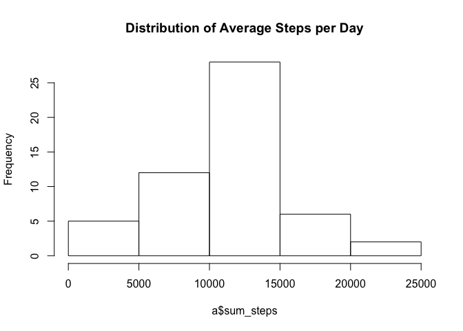
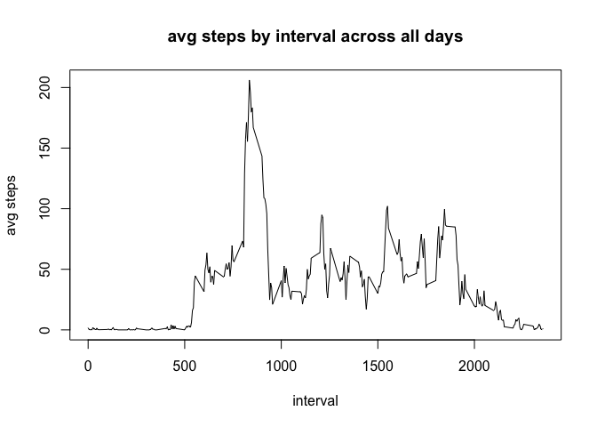
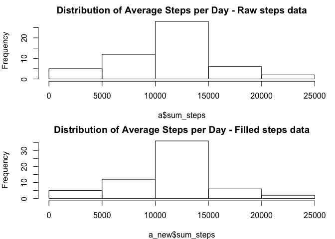
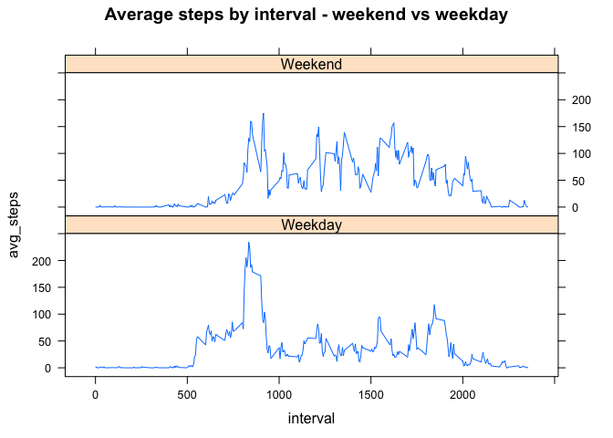

# Reproducible Research: Peer Assessment 1

First, load the libraries we will need.

## libraries 


```
## 
## Attaching package: 'dplyr'
```

```
## The following objects are masked from 'package:plyr':
## 
##     arrange, count, desc, failwith, id, mutate, rename, summarise,
##     summarize
```

```
## The following objects are masked from 'package:stats':
## 
##     filter, lag
```

```
## The following objects are masked from 'package:base':
## 
##     intersect, setdiff, setequal, union
```

## Some data cleaning steps 

## Loading and preprocessing the data

Load the data and show a summary of the data


```r
x <- read.csv("/Users/billyeskel/Documents/My GitHub Repository/RepData_PeerAssessment1/activity.csv",      stringsAsFactors = FALSE, na.strings = c("NA")) 
summary(x)
```

```
##      steps            date              interval     
##  Min.   :  0.00   Length:17568       Min.   :   0.0  
##  1st Qu.:  0.00   Class :character   1st Qu.: 588.8  
##  Median :  0.00   Mode  :character   Median :1177.5  
##  Mean   : 37.38                      Mean   :1177.5  
##  3rd Qu.: 12.00                      3rd Qu.:1766.2  
##  Max.   :806.00                      Max.   :2355.0  
##  NA's   :2304
```

Next do some cleaning, formatting date as date and adding days of the week for later analysis. Also so the structure of the table.


```r
x$date <- as.Date(x$date, "%Y-%m-%d")
x$day <- weekdays(x$date)
x$day_cat <- as.factor(ifelse(weekdays(x$date) %in% c("Saturday","Sunday"), "Weekend", "Weekday")) 
str(x)
```

```
## 'data.frame':	17568 obs. of  5 variables:
##  $ steps   : int  NA NA NA NA NA NA NA NA NA NA ...
##  $ date    : Date, format: "2012-10-01" "2012-10-01" ...
##  $ interval: int  0 5 10 15 20 25 30 35 40 45 ...
##  $ day     : chr  "Monday" "Monday" "Monday" "Monday" ...
##  $ day_cat : Factor w/ 2 levels "Weekday","Weekend": 1 1 1 1 1 1 1 1 1 1 ...
```

## Now start answering some of the questions!

## What is mean total number of steps taken per day?

To answer this, we first need to sum the number of steps by day. (Recall that the raw data is steps by the 288 5 min intervals in a day.)

```r
a <-
     x %>%
     group_by(date) %>%
     summarize(count = n(),
          unique_date = n_distinct(date),
          unique_interval = n_distinct(interval),
          sum_steps = sum(steps) 
          ) %>% 
     ungroup() %>%
     arrange(desc(date))
head(a)
```

```
## Source: local data frame [6 x 5]
## 
##         date count unique_date unique_interval sum_steps
##       (date) (int)       (int)           (int)     (int)
## 1 2012-11-30   288           1             288        NA
## 2 2012-11-29   288           1             288      7047
## 3 2012-11-28   288           1             288     10183
## 4 2012-11-27   288           1             288     13646
## 5 2012-11-26   288           1             288     11162
## 6 2012-11-25   288           1             288     11834
```

And then we can take the mean and median

```r
mean(a$sum_steps, na.rm = TRUE)
```

```
## [1] 10766.19
```

```r
median(a$sum_steps, na.rm = TRUE)
```

```
## [1] 10765
```

And then we can look at the mean in a histogram by day to get a feel for the distribution

```r
hist(a$sum_steps, main = "Distribution of Average Steps per Day")
```

\

## What is the average daily activity pattern?

To answer this we first need to get average for each of the 288 5 minute intervals accross all days

```r
b <-
     x %>%
     group_by(interval) %>%
     summarize(count = n(),
          unique_date = n_distinct(date),
          unique_interval = n_distinct(interval),
          avg_steps = mean(steps, na.rm = TRUE), 
          median_steps = median(steps, na.rm = TRUE)
          ) %>% 
     ungroup() %>%
     arrange(interval)
head(b)
```

```
## Source: local data frame [6 x 6]
## 
##   interval count unique_date unique_interval avg_steps median_steps
##      (int) (int)       (int)           (int)     (dbl)        (int)
## 1        0    61          61               1 1.7169811            0
## 2        5    61          61               1 0.3396226            0
## 3       10    61          61               1 0.1320755            0
## 4       15    61          61               1 0.1509434            0
## 5       20    61          61               1 0.0754717            0
## 6       25    61          61               1 2.0943396            0
```

To check this, let's look at what interval on average has the most steps.

```r
arrange(b, desc(avg_steps))[1, c("interval", "avg_steps")]
```

```
## Source: local data frame [1 x 2]
## 
##   interval avg_steps
##      (int)     (dbl)
## 1      835  206.1698
```

That makes sense. 8:35 in the morning is on average the most steps as people are just getting moving for the day.

Now let's draw a plot showing average steps by 5 minute interval


```r
plot(b$interval, b$avg_steps, type = 'l', main = "avg steps by interval across all days", xlab = "interval", ylab = "avg steps")
```

\

## Imputing missing values

Now let's do some work on the intervals where there are NAs. 

First how often are there NAs?

```r
sum(is.na(x$steps))
```

```
## [1] 2304
```

```r
NROW(x$interval)
```

```
## [1] 17568
```

```r
sum(is.na(x$steps)) / NROW(x$interval)
```

```
## [1] 0.1311475
```

Not bad as a % of 5 minute intervals across these 2 months of data. But still material enough to do something.

Merging in the interval averages from above, we will fill an NA in any interval on any day with the average for that interval across all days. 

We will create a new steps variable called steps_filled with the logic of "if NA in raw steps, use the average for that interval; if not NA then use the raw steps"  (Note leave 0s as 0s, this is just about filling in NAs)


```r
j <- merge(x = x, y = b, by = "interval", all.x = TRUE)
j$steps_filled <- ifelse(is.na(j$steps), j$avg_steps, j$steps)
```

Reorganize into a new data table to see what we did more clearly.

```r
new <- j[ , c("date", "interval", "steps", "steps_filled", "avg_steps")]
head(new)
```

```
##         date interval steps steps_filled avg_steps
## 1 2012-10-01        0    NA     1.716981  1.716981
## 2 2012-11-23        0     0     0.000000  1.716981
## 3 2012-10-28        0     0     0.000000  1.716981
## 4 2012-11-06        0     0     0.000000  1.716981
## 5 2012-11-24        0     0     0.000000  1.716981
## 6 2012-11-15        0     0     0.000000  1.716981
```

How does impact the histogram from earlier on the distribution of the average number of steps per day?

First, sum the steps_filled by day


```r
a_new <-
     new %>%
     group_by(date) %>%
     summarize(count = n(),
          unique_date = n_distinct(date),
          unique_interval = n_distinct(interval),
          sum_steps = sum(steps_filled) 
          ) %>% 
     ungroup() %>%
     arrange(desc(date))
```

And then make 2 histograms (first the original and second the one based on steps_filled)


```r
par(mfrow = c(2, 1), mar = c(4, 4, 2, 1)) 
hist(a$sum_steps, main = "Distribution of Average Steps per Day - Raw steps data")
hist(a_new$sum_steps, main = "Distribution of Average Steps per Day - Filled steps data")
```

\

## Are there differences in activity patterns between weekdays and weekends?

First get the average number of steps by weekday and weekend. 


```r
b2 <-
     x %>%
     group_by(day_cat, interval) %>%
     summarize(count = n(),
          unique_date = n_distinct(date),
          unique_interval = n_distinct(interval),
          avg_steps = mean(steps, na.rm = TRUE) 
          ) %>% 
     ungroup() %>%
     arrange(interval)
```

And then plot by interval weekend vs weekday

```r
xyplot(avg_steps ~ interval | day_cat, data = b2, type = 'l', main = "Average steps by interval - weekend vs weekday", layout = c(1, 2))
```

\
